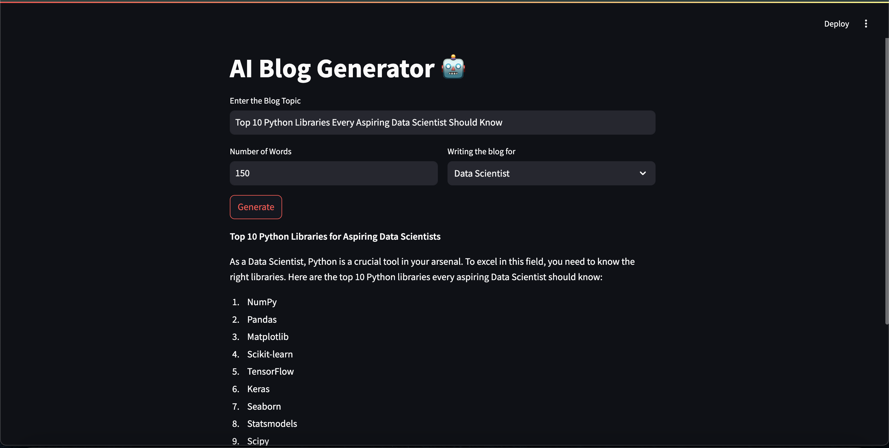

# AI Blog Generator 🤖

An AI-powered web application that generates blogs tailored to different audiences, such as researchers, data scientists, or common readers, based on the given topic and word limit. Built using **Streamlit** and **LangChain**, this app leverages cutting-edge language models to create professional and engaging blog content effortlessly.


---

## Features
- 📚 **Custom Blog Generation**: Generate blogs for specific audiences (Researchers, Data Scientists, Common People).
- 📝 **Word Limit Control**: Specify the desired number of words for the blog.
- 🚀 **User-Friendly Interface**: Clean and intuitive interface using Streamlit.
- 🔒 **Powered by LangChain**: Utilizes LangChain and ChatGroq for robust and scalable AI interactions.


---

## Setup and Installation

### 1. Clone the Repository
```bash
git clone https://github.com/Aytaditya/AI-Blog-Generator.git
cd AI-Blog-Generator
```

### 2. Install Dependencies
Ensure you have Python 3.10+ installed. Use the following command to install the required libraries:
```bash
pip install -r requirements.txt
```

### 3. Environment Variables
Replace the placeholder in the `getLLMResponse` function with your **Groq API Key**. You can obtain it from the [Groq API](https://www.groq.ai/).

```python
groq_api_key="your_groq_api_key_here"
```

### 4. Run the Application
Run the Streamlit app using:
```bash
streamlit run app.py
```

---

## Usage
1. **Enter the Blog Topic**: Provide the main topic of the blog.
2. **Set Word Limit**: Input the desired number of words.
3. **Select Audience**: Choose the target audience for the blog (e.g., Researchers).
4. **Generate Blog**: Click the "Generate" button to create the blog.

The generated blog will be displayed on the screen.

---

## Project Structure
```
.
├── app.py               # Main application file
└── README.md            # Project documentation
```

---

## Technologies Used
- **Python**: Core programming language.
- **Streamlit**: For building the user interface.
- **LangChain**: Framework for managing language model interactions.
- **ChatGroq**: AI model for generating blog content.

---

## Contributing
Contributions are welcome! Follow these steps to contribute:
1. Fork the repository.
2. Create a new branch: `git checkout -b feature-branch`.
3. Commit your changes: `git commit -m 'Add new feature'`.
4. Push to the branch: `git push origin feature-branch`.
5. Open a Pull Request.

---
